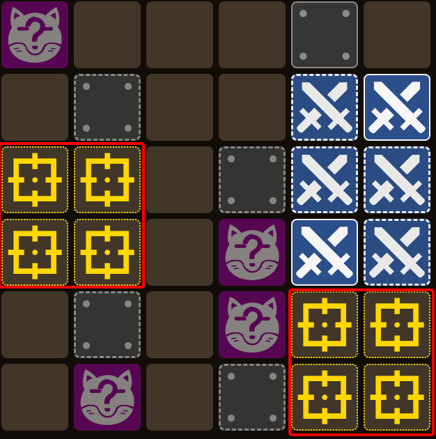
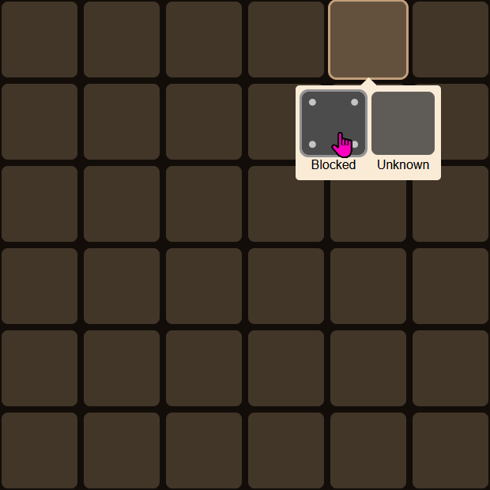

# FFXIV Faux Hollows Solver

Solver for the [Final Fantasy XIV](https://www.finalfantasyxiv.com/) [Faux Hollows minigame](https://ffxiv.consolegameswiki.com/wiki/Faux_Hollows).

Powered by [Community Data Spreadsheet by u/Ylandah](https://docs.google.com/spreadsheets/d/1mUyCzlzDmdXMwaSTUgWXtEA45oJNn-iB4_bVM43zf58/edit?gid=49331949#gid=49331949"), inspired by [u/d00tt3hsm00t's post on what a pattern missing in the spreadsheet actually means](https://www.reddit.com/r/ffxiv/comments/16wl1e7/comment/kev50wv/).

## Features

- [Guarantees† uncovering the Present and all possible fox locations](#statistical-probabilities)
  - ~89% chance to uncover the Sword & Present
  - ~95% chance to uncover the Sword & Fox‡
  - ~11% chance to uncover everything (Sword + Present + Fox)‡
- [Excludes impossible board states](#excludes-impossible-board-states)
- [Displays possible fox locations automatically](#displays-possible-fox-locations-automatically)
- [Short-cut Blocked tile entries](#short-cut-blocked-tile-entries)
- [Contextual help](#contextual-help)
- [Recursive solver identifies hard-to-spot optimizations](#recursive-solver-identifies-hard-to-spot-optimizations)
- [Input error detection](#input-error-detection)
- Extensively tested

<br>
† If I have made no errors and when following recommended suggestions.

‡ If the fox is present.

### Statistical Probabilities

Odds of uncovering the given shapes across all patterns.

```
All                        Steps  Fox  <=11    >11    No fox  <=11    >11
-------------------------  -----  ---  ------  -----  ------  ------  ------
  Uncover Sword & Present               89.1%  10.9%           88.9%   11.1%
  Uncover Sword & Fox                   95.6%   4.4%           82.5%   17.5%
  Uncover Present & Fox                100.0%   0.0%          100.0%    0.0%
  Uncover All                           11.6%  88.4%            0.0%  100.0%
```

- The `<=11` (11 or fewer moves) column is the success percentage, since players have 11 moves in Faux Hollows.
- Fox means a fox is present, no fox means it is not. No fox is equivalent to finding the fox at the last possible location.

[The full results are available here.](./docs/solve-methods/result-logs/community-data-recursive-fast.txt)

> [!NOTE]
> Disclaimer: These statistics are one possible interpretation of the data.
>
> See [docs/solve-methods/README.md](./docs/solve-methods/README.md) for details.

### Excludes impossible board states

Leveraging the data from the [Community Data Spreadsheet by u/Ylandah](https://docs.google.com/spreadsheets/d/1mUyCzlzDmdXMwaSTUgWXtEA45oJNn-iB4_bVM43zf58/edit?gid=49331949#gid=49331949"), many patterns which seem possible are omitted.

For example, in the following board there are five spots where a Present could fit:


But in reality the game will only ever use these two locations:



In this example, this is the difference from having a 2/5 chance of being able to uncover the Sword + Gift box to being guaranteed the Sword + Gift box.

### Displays possible fox locations automatically

Fox locations are automatically shown when there are four or less possible fox locations remaining.

> [!NOTE]
> Why four?
>
> Each pattern has exactly four possible fox locations, and this solver always finds the exact pattern in three or less moves,
> so this strategy on average uses less moves to check all possible fox locations.

### Short-cut Blocked tile entries

Only one to three blocked tiles need to be entered to uniquely identify a board pattern, the rest will be automatically filled in. Here's an optimal case with just one blocked tile identifying the C↑ board pattern:


->


### Contextual help

Contextual help will be displayed based on what has been entered into the board:


In addition to the summary help, detailed help is available by clicking or tapping the active help entries to expand them:


### Recursive solver identifies hard-to-spot optimizations

Consider this board:


Looking at the [Community Data Spreadsheet by u/Ylandah](https://docs.google.com/spreadsheets/d/1mUyCzlzDmdXMwaSTUgWXtEA45oJNn-iB4_bVM43zf58/edit?gid=22642346#gid=22642346") (this is C↑), we can see there are four possible Present locations for this Sword location:


There are also three tiles where two Presents overlap:


But the solver is only suggesting two of these tiles, why?

First, let's consider the tile the solver is not suggesting.

There are three outcomes:

1. The present from the 2nd pattern in the picture is there
1. The present from the 3rd pattern in the picture is there
1. The tile is empty

In the first two cases, we are done (the board is solved). In the third case, there is now a 50/50 for any of the tiles (we will either find a present or find an empty tile; in either case we know the actual board pattern).

Now let's consider one of the solver suggested tiles.

There are still three outcomes:

1. The present from the 2nd pattern in the picture is there
1. The present from the 4th pattern in the picture is there
1. The tile is empty

In the first two cases, we are done like before. In the third case though, it is no longer a 50/50 because one of the fox locations for 1st pattern overlaps with the present in the 3rd pattern; by picking that square there is now the (rare) chance we find a fox and, even if we don't, if it is the 1st pattern we have still eliminated a possible fox location.

This difference matters because we subtracted one from the maximum number of moves for Sword + Fox, which previously needed a maximum of 12 moves to uncover the Sword and all fox candidates<sup>[[1]](#footnote-1)</sup>.

Ultimately, this (and it's three rotations) is the only identified case of a benefit to evaluating more than one move deep.

### Input error detection

Input which does not match any possible pattern is automatically detected and an error is displayed, preventing trying to solve an impossible board:


## Local Development

See [DEVELOPMENT.md](./DEVELOPMENT.md)

# Footnotes

## Footnote 1

To see why, let's consider the worst case with the tile the solver wasn't suggesting:

1. Found Sword
2. Empty (the tile the solver wasn't suggesting)
3. Empty (the 4th pattern in the picture)

We now know we have the 1st pattern, are 3 moves in and need:

- 5 more moves to fill in the Sword,
- 4 more moves to fill in the Present, and
- 4 more moves to check all Fox locations.

In terms of strategies that's:

- Sword + Present -> 3 + 5 + 4 -> 12 (!)
- Sword + Fox -> 3 + 5 + 4 -> 12 (!)
- Present + Fox -> 3 + 4 + 4 -> 11

In comparison:

1. Found Sword
2. Empty (one of the tiles suggested by the solver)
3. Empty (the tile where the fox and present of the two remaining patterns overlap)

We now know we have the 1st pattern, are 3 moves in and need:

- 5 more moves to fill in the Sword,
- 4 more moves to fill in the Present, and
- just 3 more moves to check all Fox locations.

In terms of strategies that's:

- Sword + Present -> 3 + 5 + 4 -> 12 (!)
- Sword + Fox -> 3 + 5 + 3 -> 11
- Present + Fox -> 3 + 4 + 3 -> 10
