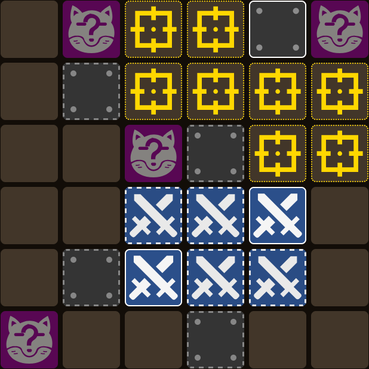

# Statistical Data Collection

This document describes how the statistical data results (in the result logs folders) for each solver method are generated.

## Full Solve

The full solve tries every possible sequence of recommended moves for every identifier (A↑, A←, A→, etc...) for every pattern (A→ ▭25 ◻14, A→ ▭25 ◻4, etc...) for every possible fox location using several possible strategies:

1. Sword & Present (prioritize uncovering the Sword and Present)
1. Sword & Fox (etc...)
1. Present & Fox
1. All

These results are then rolled-up into summary data which is easier to consume.

### Assumptions

The core assumption made is with regards to the percentages displayed; specifically, these are percentages of what exactly?

The simplest approach might be to use the percentage of every possible sequence of recommended moves; this however would, in my opinion, provide more weight to cases where multiple tiles lead to the same result (addressed with unique outcome deduplication) and towards patterns which happen to have more possible sequences (addressed with pattern normalization). Both are discussed in detail below.

Pattern normalization also has another assumption: Each _pattern_ is equally likely, and thus each contributes an equal amount to the overall probabilities. There are no statistics on pattern frequency, so this is an assumption. One potential alternative is the game picks an identifier (e.g. A→) and then picks a pattern within that scope. This would slightly change the results as identifier group C has 15 patterns, while the other three have 16.

####

### Adjustments

The main metrics in these logs are post-processed with "unique outcomes" and "pattern normalized" adjustments, with the general goal of increasing the accuracy of the odds of various strategies succeeding.

#### Unique outcomes

Unique outcomes refers to removing solves which are identical in terms of outcome into a single path. For example, There are only two possible Present locations at this point:
<br>&nbsp;&nbsp;

The full solver will try all 8 of the tiles (because it makes no assumptions), but there are only two unique choices (any of the squares in the first present candidate, any of the squares in the second present candidate).

This matters for the percentages we are generating in the larger picture because if for example there was a 50/50 for a Sword, that would be 12 possibilities instead of 8, or if due to a potential fox there was just one possibility, the percentages would be skewed towards cases where multiple identical paths lead to the same result.

Unique outcomes are calculated by comparing the state at every step (what was found, which \[exact] possible patterns remain, how many fox candidates remain, etc...) and keeping only one.

#### Pattern normalized

Pattern normalized refers to adjusting the percentages so that each pattern (A→ ▭25 ◻14, A→ ▭25 ◻4, etc...) within the given scope (e.g. All, A→, etc...) contribute a total value of 1/(total pattern count).

To give an example, say we are looking at A↑.

```
With pattern normalization:
Rollup of A↑               Steps  Fox  <=11    >11    No fox  <=11    >11
-------------------------  -----  ---  ------  -----  ------  ------  ------
  Uncover Sword & Present               93.8%   6.3%           93.8%    6.3%

Without pattern normalization:
Rollup of A↑               Steps  Fox  <=11    >11    No fox  <=11    >11
-------------------------  -----  ---  ------  -----  ------  ------  ------
  Uncover Sword & Present               96.9%   3.1%           96.4%    3.6%
```

Why the difference? Let's look at each pattern:

12 of the 16 patterns are uncover the first suggestion, fill in the Sword which was there, 50/50 the present location.

In unique outcome terms (ignoring then finding the foxes for simplicity), each pattern has exactly two paths:

1. Sword -> Present
1. Sword -> Empty (Present found by inference)

In the shorthand syntax (with no fox present), that's: `T[14,15] t6 s1 p2 S6 P[5,6] SP[10,11] F5 SF10 PF[9,10]`

Note that in either case, SP is solved in 11 or less steps.

For the remaining 4, two are:

1. Present (Sword also found by inference)

That's: `T14 t5 s1 p1 S7 P4 SP10 F5 SF11 PF8`

One is:

1. Empty (Sword found by inference) -> Empty (Present found by inference)

That's `T15 t5 s1 p2 S7 P6 SP12 F5 SF11 PF9`

And one is:

1. Empty (Sword found by inference) -> Present

That's `T15 t6 s1 p2 S7 P5 SP11 F6 SF12 PF9`

Note how the first 12 have two paths, so (without pattern normalization) they effectively have double the weighting for the percentage (because we are reporting the percentage of unique outcomes).

Thus there are `(12 * 2) + 1 + 1 + 1` outcomes where SP <= 11, and `1` outcome where it is >11.

Doing the math: `1 / 28 * 100 = 3.57142857%`, which rounds to 3.6%.

If instead normalized the result so that each pattern had equal weight, we would get `1 / 16 * 100 = 6.25%`, which rounds to 6.3%.

Normalization itself is quite simple, we calculate the percent of each pattern independently (which effectively divides 100 among all outcomes for that pattern), and then calculate the percent of that percent by dividing the sum for each bucket (e.g. <=11 and >11) by the total number of patterns.

## Short Circuit Solve

This was the original solve approach used for comparing approaches. It uses math and logic to calculate the same set of statistics as the full solve with a fraction of the work (specifically, it only goes down each path once, and only to the point at which all shapes have been found).

This is much faster (and _in some cases_ was verified produced the same results for foxes present after adding the full solve), but is far harder to understand and will probably be removed in the future.

### Short overview

Once the Sword and Present are located, evaluation stops as there (is "short-circuited") is a static number of possible steps left based on how many candidate locations for the fox remain (if the fox has not already been found).

With this in mind, _Total variations calculated_ is the total result set with the short-circuit logic. These results have a min and max value for the Fox and All/Total step values. TThe full listing of this is printed at the bottom of the result log.

_Total variations explored_ is the number of board states if we didn't short-circuit; this result set is actually generated from the "total variations calculated" and used to generate the _Total after deduplication_, which is the "Total variations explored" with inconsequential variations removed.

An "inconsequential variations" occurs when two or more variations have the same step numbers across the board. In this case, only one is kept and the remainder are removed. This ignores the steps themselves (which are unique), but naturally accounts for meaningful differences in the steps.

For example (A up):

```
  ▯16 ◻0
     Fox at 3
       t[3,6] T[11,14] s1 S6 p2 P5 F[3,6] SF[8,11] PF[6,9] | -> 22->S, 0->P
       t[3,6] T[11,14] s1 S6 p2 P5 F[3,6] SF[8,11] PF[6,9] | -> 22->S, 1->P
       t[3,6] T[11,14] s1 S6 p2 P5 F[3,6] SF[8,11] PF[6,9] | -> 22->S, 6->P
       t[3,6] T[11,14] s1 S6 p2 P5 F[3,6] SF[8,11] PF[6,9] | -> 22->S, 7->P
```

Here we have four different possibilities which give the same result. Keeping all four skews averages, because if one approach reports just one of these Present options and another reports all four, they are effectively equal but when compared against the entire data set the approach with all four may appear better or worse (other things equal) depending on if 2 steps to solve is better or worse than average.
